# Musaic — Tez Raporu Diyagramları (PDF Uyumlu)

> Her diyagram ayrı ayrı [mermaid.live](https://mermaid.live) üzerinden PNG/SVG olarak export edilebilir.
> Diyagramlar sadeleştirilmiş ve PDF'te okunabilir boyutta tasarlanmıştır.

---

## 1. UML Sınıf Diyagramları

### 1.1. MVVM Katmanları — View ve ViewModel İlişkileri

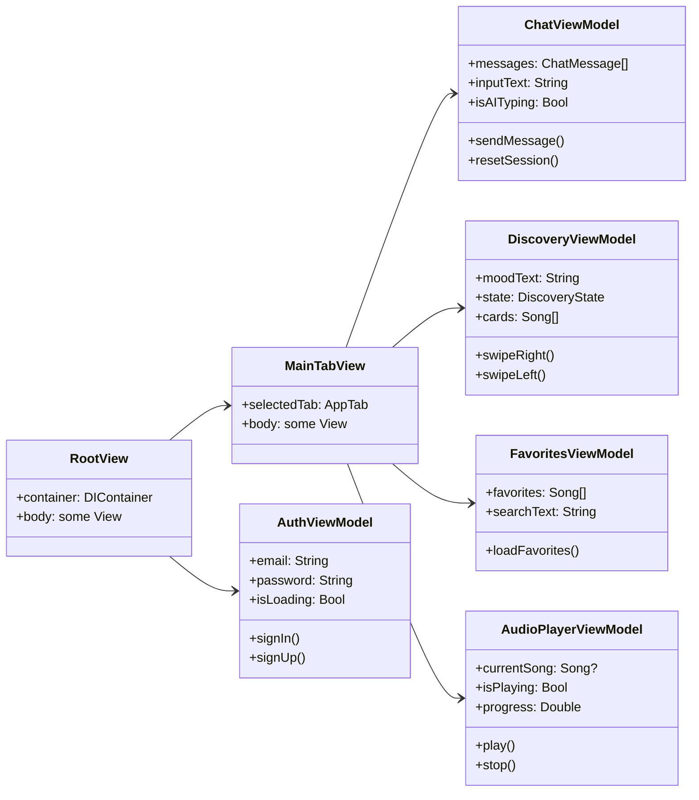

### 1.2. Domain Modelleri

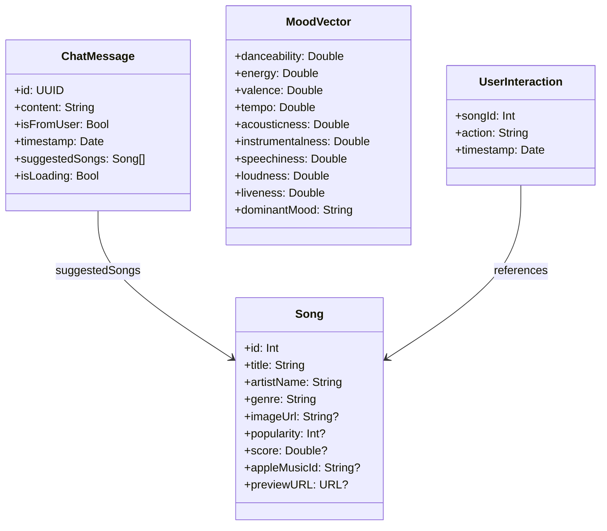

### 1.3. Servis Protokolleri ve Implementasyonları

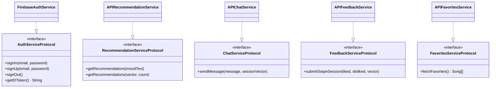

### 1.4. Networking Katmanı

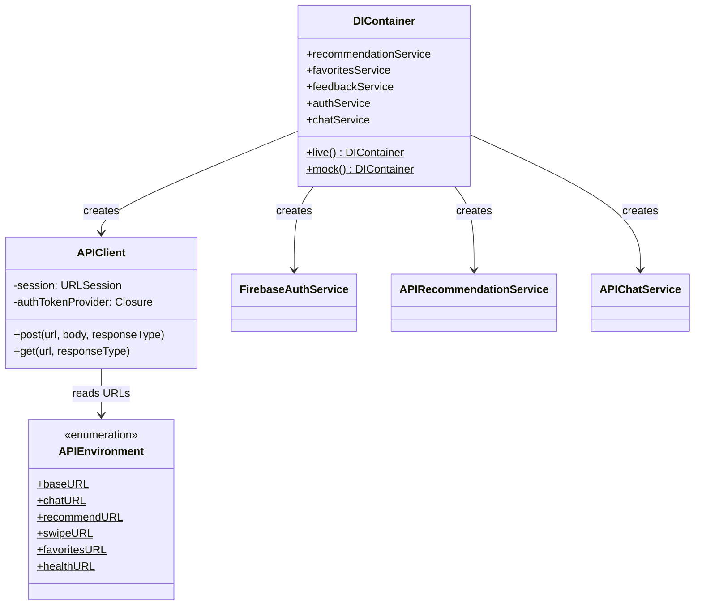

---

## 2. Sequence (Sıralama) Diyagramları

### 2.1. Kimlik Doğrulama Akışı

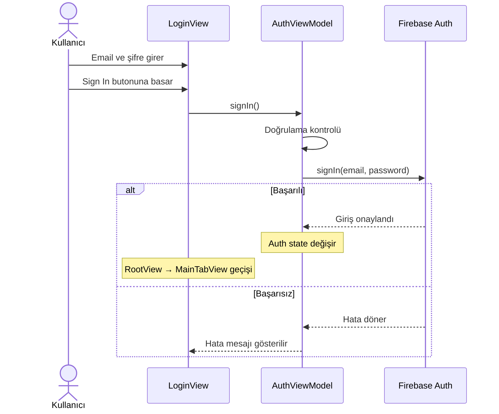

### 2.2. Mood Analizi ve Şarkı Önerisi Akışı

```mermaid
sequenceDiagram
    actor User as Kullanıcı
    participant View as DiscoveryView
    participant VM as DiscoveryVM
    participant API as FastAPI Backend
    participant AM as Apple Music

    User->>View: Mood metni girer
    View->>VM: analyzeMoodAndFetchSongs()

    rect rgb(60, 60, 90)
        Note right of VM: Aşama 1 — NLP Analizi
        VM->>API: POST /api/chat (mesaj + vektör)
        API->>API: Gemini ile NLP analizi
        API-->>VM: AI yanıtı + 9D mood vektörü
    end

    rect rgb(60, 90, 60)
        Note right of VM: Aşama 2 — Şarkı Önerisi
        VM->>API: POST /api/recommend (vektör, n=15)
        API->>API: Cosine similarity hesaplama
        API-->>VM: 15 şarkı listesi
    end

    rect rgb(90, 60, 60)
        Note right of VM: Aşama 3 — Zenginleştirme
        VM->>AM: Paralel arama (artwork + preview)
        AM-->>VM: Albüm kapağı + 30s preview URL
    end

    VM-->>View: Swipe kartları gösterilir
    View-->>User: Kartları kaydırmaya başlar
```

### 2.3. Swipe Geribildirimi Akışı

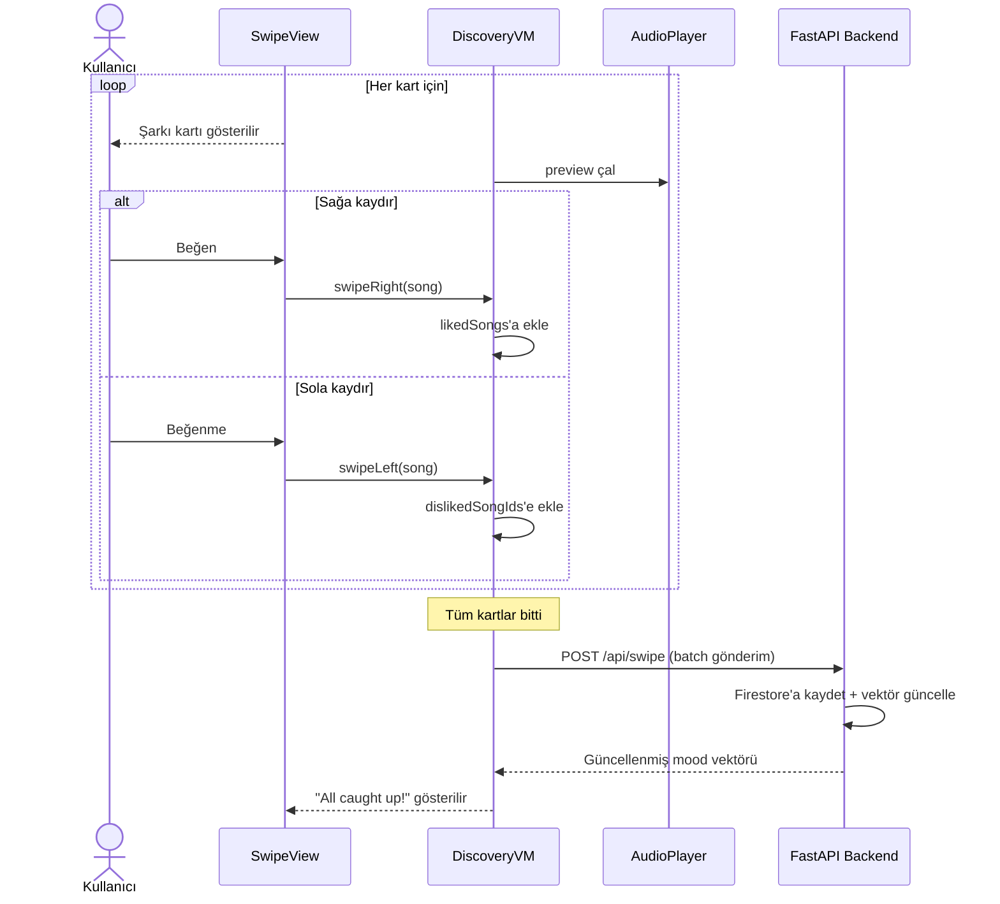

### 2.4. AI Chat Akışı

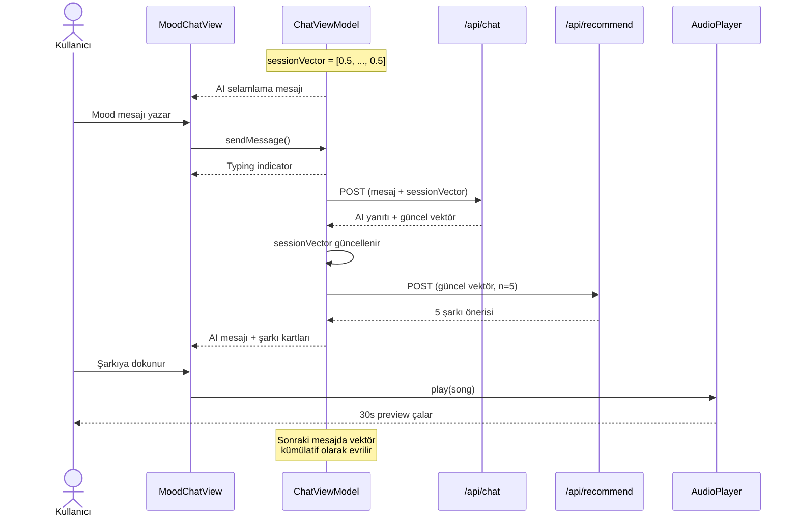

---

## 3. Akış Diyagramları (Flowcharts)

### 3.1. Genel Uygulama Akışı

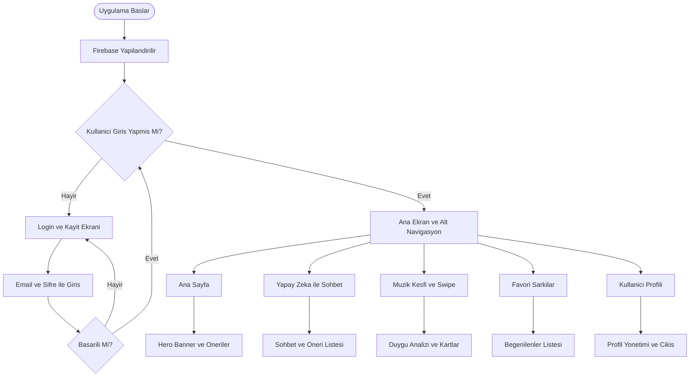

### 3.2. Discovery Detaylı Akışı

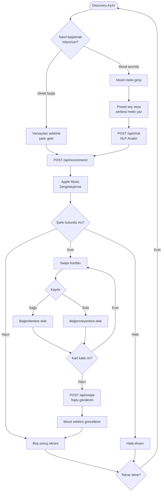

### 3.3. API İstek Akışı

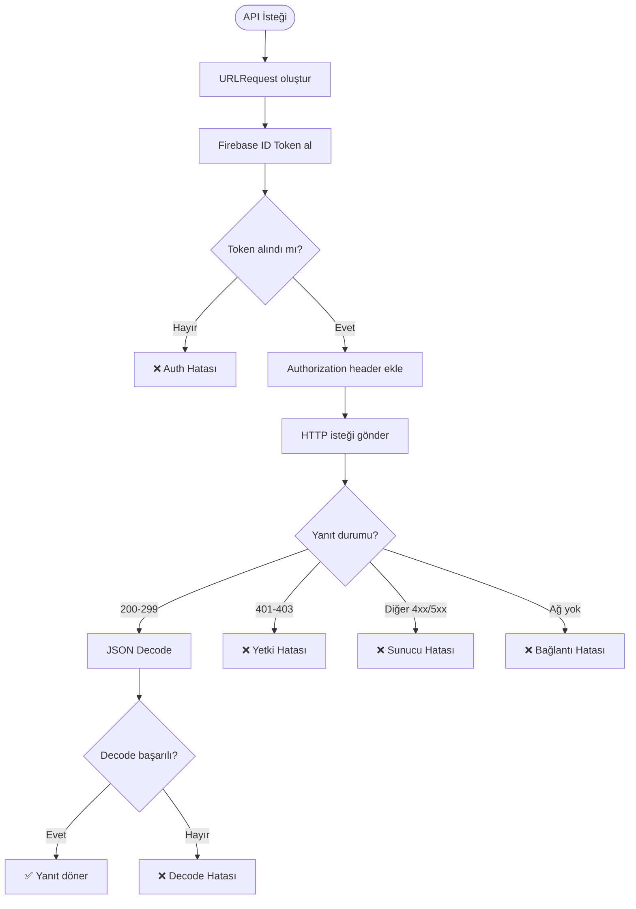

---

## 4. State (Durum) Diyagramı — Discovery Modülü

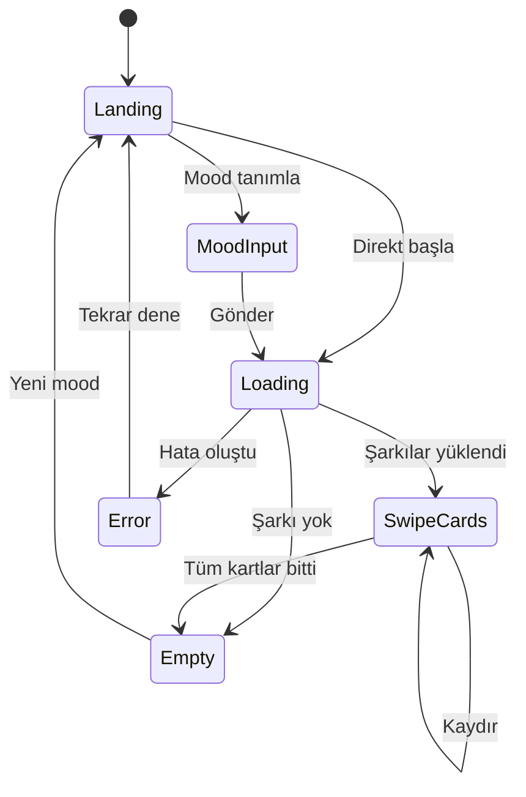

---

## 5. Component (Bileşen) Diyagramı — Katmanlar

```mermaid
flowchart TB
    %% Layer 1: Presentation Layer
    subgraph Layer1["🖥️ PRESENTATION LAYER (SwiftUI)"]
        direction LR
        Views["<b>Views</b><br/>• RootView<br/>• MainTabView<br/>• LandingHomeView<br/>• MoodChatView<br/>• DiscoveryViews<br/>• FavoritesView<br/>• LoginView/SignUp<br/>• ProfileView"]
    end

    %% Layer 2: ViewModel Layer
    subgraph Layer2["⚙️ VIEWMODEL LAYER (MVVM — @MainActor, ObservableObject)"]
        direction LR
        VMs["<b>ViewModels</b><br/>• AuthViewModel<br/>• ChatViewModel<br/>• DiscoveryViewModel<br/>• FavoritesViewModel<br/>• AudioPlayerViewModel"]
    end

    %% Layer 3: Service Layer
    subgraph Layer3["🔌 SERVICE LAYER (Protocol-Oriented Abstraction)"]
        direction TB
        subgraph Protocols["📜 Protocols (Abstraction)"]
            P1["RecommendationServiceProtocol"]
            P2["ChatServiceProtocol"]
            P3["FeedbackServiceProtocol"]
            P4["FavoritesServiceProto"]
            P5["AuthServiceProtocol"]
            P6["AppleMusicServiceProto"]
            P7["NLPServiceProtocol"]
        end
        subgraph Impls["📦 Implementations (Production)"]
            I1["APIRecommendationService"]
            I2["APIChatService"]
            I3["APIFeedbackService"]
            I4["APIFavoritesService"]
            I5["FirebaseAuthService"]
            I6["AppleMusicService"]
        end
        subgraph Mocks["🧪 Mock Implementations (UI Dev)"]
            M1["MockChatService"]
            M2["MockRecommendationSvc"]
            M3["MockFavoritesService"]
            M4["MockFeedbackService"]
        end
        
        Protocols -.-> Impls
        Protocols -.-> Mocks
    end

    %% Layer 4: Networking Layer
    subgraph Layer4["🌐 NETWORKING LAYER"]
        direction TB
        Client["APIClient (Generic POST/GET, Auth Token Injection)"]
        Env["APIEnvironment (URL Endpoint Definitions)"]
        subgraph DTOs["✉️ DTOs (Request/Response Data Transfer Objects)"]
            D1["ChatRequestDTO / ChatResponseDTO"]
            D2["RecommendRequestDTO / RecommendResponseDTO"]
            D3["BatchSwipeRequestDTO / BatchSwipeResponseDTO"]
            D4["FavoritesResponseDTO"]
            D5["HealthResponseDTO"]
        end
        Client --> DTOs
        Env --> Client
    end

    %% Layer 5: DI Container
    subgraph Layer5["🏗️ DI CONTAINER"]
        direction LR
        DI["DIContainer.swift<br/>• <b>.live()</b> → Production API Services<br/>• <b>.mock()</b> → UI Development Mock Services"]
    end

    %% Layer 6: External Services
    subgraph Layer6["☁️ EXTERNAL SERVICES"]
        direction LR
        E1["Firebase Authentication"]
        E2["Firebase Firestore"]
        E3["Apple MusicKit"]
        E4["FastAPI Backend"]
    end

    %% Connect layers
    Layer1 --> Layer2
    Layer2 --> Layer5
    Layer5 --> Layer3
    Layer3 --> Layer4
    Layer4 --> Layer6

    %% Styling
    style Layer1 fill:#1a1c23,stroke:#707b93,stroke-width:2px,color:#fff
    style Layer2 fill:#1f2335,stroke:#bb9af7,stroke-width:2px,color:#fff
    style Layer3 fill:#1f2335,stroke:#7aa2f7,stroke-width:2px,color:#fff
    style Layer4 fill:#1f2335,stroke:#2ac3de,stroke-width:2px,color:#fff
    style Layer5 fill:#1a1c23,stroke:#ff9e64,stroke-width:2px,color:#fff
    style Layer6 fill:#1a1c23,stroke:#9ece6a,stroke-width:2px,color:#fff

    style Protocols fill:#24283b,stroke:#565f89,stroke-width:1px,color:#cfc9c2
    style Impls fill:#24283b,stroke:#2ac3de,stroke-width:1px,color:#cfc9c2
    style Mocks fill:#24283b,stroke:#ff9e64,stroke-width:1px,color:#cfc9c2
    style DTOs fill:#24283b,stroke:#565f89,stroke-width:1px,color:#cfc9c2
```
